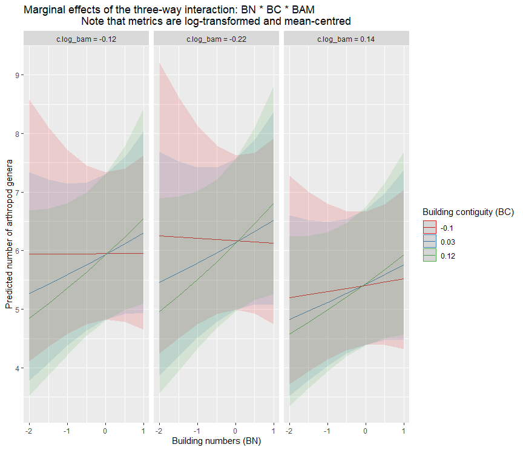

```{r setup, include=FALSE}
knitr::opts_chunk$set(echo = FALSE)
```

```{r session information}
rm(list=ls())
sessionInfo()
```
\
\


# Exploration préparatoire des données
## Résumé général

Pour le moment, je ne présente que les traitements qui concernent l'ensemble des ordres d'arthropodes (potentiellement pollinisateurs), à savoir les 8 ordres suivants par ordre de fréquence décroissante: **diptères** (mouches, syrphes etc.), **hyménoptères** (abeilles, guêpes, fourmis etc.), **coléoptères** (carabes etc.), **lépidoptères** (papillons), **hémiptères** (punaises, pucerons etc.), **Aranéides** (araignées), **orthoptères** (sauterelles, grillons etc.), et **névroptères** (mantispe etc.).
Je n'ai pas eu le temps de refaire tourner les analyses pour les 4 ordres principaux de pollinisateurs.

```{r data import and summary, include=TRUE}
library(magrittr)
.pardefault <- par() # To save the default graphical parameters (in case I want to restore them).

rgenera <- read.csv2(here::here("data/spipoll_obs13_genre2ordre_work.csv"), na.strings = "")
rsites <- read.csv2(here::here("data", "national_data500.csv"))
rcoord <- read.csv2(here::here("data/spipoll_obs13_genre2ordre_geom.csv"))

rgenera %>% dplyr::mutate(
  collection = as.factor(collection),
  espece_fleur = as.factor(espece_fleur),
  date_de_session = as.factor(date_de_session),
  espece_insecte = as.factor(espece_insecte),
  genre_insecte = as.factor(genre_insecte),
  famille_insecte = as.factor(famille_insecte),
  ordre_insecte = as.factor(ordre_insecte)
  ) %>%
  dplyr::rename(
    flower_sp = espece_fleur,
    date = date_de_session,
    observed_arthropoda = espece_insecte,
    obs_genus = genre_insecte,
    obs_family = famille_insecte,
    obs_order = ordre_insecte
  ) -> rgenera

rsites %>% dplyr::mutate(
  collection = as.factor(collection),
  espece_fleur = as.factor(espece_fleur),
  ville = as.factor(ville),
  code_ua = as.factor(UA_code_2018_simp)) %>%
  dplyr::relocate(code_ua, .after = UA_code_2018_simp) -> rsites

rcoord %>% dplyr::mutate(collection = as.factor(collection),
                         xcoord = as.numeric(xcoord),
                         ycoord = as.numeric(ycoord)) -> rcoord

rgenera$coord_x <- rcoord$xcoord
rgenera$coord_y <- rcoord$ycoord
rgenera %>% dplyr::relocate(coord_x, .after = date) %>%
  dplyr::relocate(coord_y, .after = coord_x) -> rgenera


### ** 0.1.2. Data preparation and cleaning ----
# ______________________________________________

### *** 0.1.2.1. Computing richness for corrected genera data ----
## For all arthropods:
rgenera %>% dplyr::group_by(collection) %>%
  dplyr::summarise(flower_sp = dplyr::first(flower_sp),
                   date = dplyr::first(date),
                   coord_x = mean(coord_x),
                   coord_y = mean(coord_y),
                   genus_richness = dplyr::n_distinct(obs_genus, na.rm = TRUE),
                   family_richness = dplyr::n_distinct(obs_family),
                   order_richness = dplyr::n_distinct(obs_order)) -> richness_arthro

## For the main pollinator orders only:
rgenera %>% dplyr::filter(obs_order %in% c("Diptera", "Hymenoptera", "Coleoptera", "Lepidoptera")) %>%
  dplyr::group_by(collection) %>%
  dplyr::summarise(flower_sp = dplyr::first(flower_sp),
                   date = dplyr::first(date),
                   coord_x = mean(coord_x),
                   coord_y = mean(coord_y),
                   genus_richness = dplyr::n_distinct(obs_genus, na.rm = TRUE),
                   family_richness = dplyr::n_distinct(obs_family),
                   order_richness = dplyr::n_distinct(obs_order)) -> richness_polli


### *** 0.1.2.2. Data reduction ----
rsites %>% tidyr::drop_na() %>%
  dplyr::filter(bn > 5) %>% # I only keep sites with at least 5 buildings
  dplyr::select(-nb_insecte, -nb_espece_insecte, -nb_famille_insecte, -nb_ordre_insecte, -rayon,
                -log_nb_insecte, -log_nb_espece_insecte, -log_nb_famille_insecte, -log_nb_ordre_insecte,
                -UA_code_2018_simp) %>%
  dplyr::select(!dplyr::starts_with("log")) %>% # Deletes columns that start with...
  tibble::as_tibble() %>%
  janitor::clean_names() -> rsites # The "clean_names" function sets every name to lower cases!


# Deleting the original OSO variables:
rsites %>% dplyr::select(!dplyr::starts_with("oso") | dplyr::starts_with("oso_f")) -> site_metrics


### *** 0.1.2.3. Joining datasets ----
srich_arthro <- dplyr::left_join(x = site_metrics, y = richness_arthro, by = "collection")
srich_arthro %>% tidyr::drop_na() %>%
  dplyr::select(-espece_fleur) %>%
  dplyr::relocate(date, .after = collection) %>%
  dplyr::relocate(flower_sp, .after = date) %>%
  dplyr::relocate(coord_x, .after = ville) %>%
  dplyr::relocate(coord_y, .after = coord_x) %>%
  dplyr::relocate(genus_richness, .after = flower_sp) %>%
  dplyr::relocate(family_richness, .after = genus_richness) %>%
  dplyr::relocate(order_richness, .after = family_richness) -> srich_arthro

srich_polli <- dplyr::left_join(x = site_metrics, y = richness_polli, by = "collection")
srich_polli %>% tidyr::drop_na() %>%
  dplyr::select(-espece_fleur) %>%
  dplyr::relocate(date, .after = collection) %>%
  dplyr::relocate(flower_sp, .after = date) %>%
  dplyr::relocate(coord_x, .after = ville) %>%
  dplyr::relocate(coord_y, .after = coord_x) %>%
  dplyr::relocate(genus_richness, .after = flower_sp) %>%
  dplyr::relocate(family_richness, .after = genus_richness) %>%
  dplyr::relocate(order_richness, .after = family_richness) -> srich_polli
summary(srich_arthro)
```
\


## Recherche de valeurs extrêmes et aberrantes

```{r boxplot, include=TRUE, message=FALSE, comment=NA}
ppl.tits::uni.boxplots(srich_arthro)
```

La même chose mais présenté autrement. Ce sont des *dotplots de Cleveland* qui présentent la distribution des données (abscisse) en fonction de leur rang (ordonnée).

```{r dotplot, include=TRUE, message=FALSE, comment=NA}
ppl.tits::uni.dotplots(srich_arthro)
```

On voit qu'il y a quelques valeurs extrêmes pour certaines métriques. Ce sont des sites parisiens qui présentent des configurations assez atypiques, donc ce ne sont pas de vrais *outliers*.
\
\

## Distribution et dissymétrie

```{r histo, include=TRUE, message=FALSE, comment=NA}
ppl.tits::uni.histograms(srich_arthro)
```
 
On a des variables très peu normales, avec des dissymétries prononcées pour BH, BAM, BASTD et surtout BHW. Mais ce sont surtout les valeurs de kurtosis qui crèvent le plafond. Il faudra peut-être transformer ces variables.

```{r skewness computation, include=TRUE, message=FALSE, comment=NA}
arthro.num <- srich_arthro[, sapply(srich_arthro, is.numeric)]
tab <- data.frame(moments::skewness(x = arthro.num), moments::kurtosis(x = arthro.num)-3)
arthro_skewkurtable <- knitr::kable(x = tab, digits = 3, col.names = c("Skewness", "Excess kurtosis"))

# It appears that:
#  - There is excess skewness for BH, BAM, BASTD, and especially BHW.
#  - There is highly excessive kurtosis for BN, BD, and especially BH, BAM, BASTD, and BHW!

arthro_skewkurtable
rm(tab)
```
\
\

## Relations bivariées

```{r correlation, include=TRUE, message=FALSE, comment=NA, warning=FALSE}
res.cor.spipoll <- round(stats::cor(arthro.num, use = "complete.obs", method = "spearman"), 2)
# To compute a matrix of correlation p-values:
res.pcor.spipoll <- ggcorrplot::cor_pmat(x = arthro.num, method = "spearman")

ggcorrplot::ggcorrplot(res.cor.spipoll, type = "upper",
                                         outline.col = "white", title = "Spearman correlation matrix",
                                         ggtheme = ggplot2::theme_gray,
                                         colors = c("#6D9EC1", "white", "#E46726"), p.mat = res.pcor.spipoll,
                                         insig = "blank")
# We can see that:
# - Taxonomic COUNTS are quite strongly positively correlated among themselves but only weakly with the other
#   other variables.
# - The DISTANCE variable is negatively correlated with BD, BH, BAM, BASTD, BHW, OSO_F1 and UA_F1!
# - BN, BD and BH are strongly positively correlated with each other and with BHW, OSO_F1 and UA_F1! They are
#   also negatively correlated with BW.
# - BW is also negatively correlated with BF, BHW and OSO_F1!
# - UA_F1 is also positively correlated with BHW and OSO_F1!
## I suggest removing BD and BASTD and perhaps BN and BHW.```
```

On peut voir que: 
* Les richesses sont très positivement corrélées.
* La *distance* est négativement corrélée avec *BD*, *BH*, *BAM*, *BASTD*, *BHW*, *OSO_F1* et *UA_F1.*
* BN, BD et BH sont très fortement corrélés entre eux et avec *BHW*, *OSO_F1* et *UA_F1*! Et négativement avec *BH*.
* BW est aussi négativement corrélé avec *BF*, *BHW* et *OSO_F1*!
* *UA_F1* est aussi positivement corrélé avec *BHW* et *OSO_F1*!
Je suggère donc d'éviter BD et BASTD. 

```{r ggpair, include=TRUE, message=FALSE, comment=NA, fig.height=12, fig.width=15}
GGally::ggpairs(arthro.num)
```

(Je copie-colle les remarques [en anglais] que j'ai noté sur mon script, ça ira plus vite que de traduire, désolé).

We find globally the same patterns:
* *BN* and *BF*, *BF* and *BW*, *BF* and *BC*, or *UA_F1* and *OSO_F1* indeed seem highly collinear.
* It is also true for *BW* but to a lesser extent and in a **curvilinear way**.
* The *BAM* metric shows diverging patterns (e.g. with *BN* and *BH*), *BHW* also but to a lesser extent!
* *BF* and *BHW* extreme values may be multivariate outliers! For *BHW*, they come from Paris so they're likely not true outliers but are characteristic from a specific urban form.
* Many relationships are likely highly collinear on the log scale: e.g. *BN*, *BH* and *BHW* with *UA_F1* or *OSO_F1*!
I suggest to avoid using *BF*, *BW* and the *F1* factors.
\
\


# Analyses statistiques
## Modélisation de la richesse en genres

Ci-dessous, les résultats des modèles pour expliquer la **richesse en genre** (i.e. le nombre de genres ou de sous-familles d'arthropodes observés sur les fleurs suivies).

```{r formatting, include=FALSE, message=FALSE, comment=NA}
srich_arthro %>% dplyr::mutate(log_bn = log10(bn),
                        sqrt_bf = sqrt(bf),
                        sqrt_bh = sqrt(bh),
                        log_bam = log10(bam),
                        log_bhw = log10(bhw)) %>%
  dplyr::relocate(log_bn, .after = bn) %>%
  dplyr::relocate(sqrt_bf, .after = log_bn) %>%
  dplyr::relocate(sqrt_bh, .after = bh) %>%
  dplyr::relocate(log_bam, .after = bam) %>%
  dplyr::relocate(log_bhw, .after = bhw) %>%
  dplyr::rename(dist_centre = part_dist_centre,
                city = ville) %>%
  dplyr::mutate(coord_y = jitter(x = coord_y, factor = 1.2)) %>%
  dplyr::mutate(coord_x = jitter(x = coord_x, factor = 1.2)) -> srich_arthro2

srich_arthro2 %>% dplyr::filter(genus_richness > 0) %>%
  dplyr::mutate(longitude = scale(coord_x),
                latitude = scale(coord_y),
                c.log_bn = scale(log_bn, scale = FALSE),
                c.sqrt_bf = scale(sqrt_bf, scale = FALSE),
                c.bd = scale(bd, scale = FALSE),
                c.bh = scale(bh, scale = FALSE),
                c.sqrt_bh = scale(sqrt_bh, scale = FALSE),
                c.bc = scale(bc, scale = FALSE),
                c.bf = scale(bf, scale = FALSE),
                c.bam = scale(bam, scale = FALSE),
                c.log_bam = scale(log_bam, scale = FALSE),
                c.bw = scale(bw, scale = FALSE),
                c.bhw = scale(bhw, scale = FALSE),
                c.log_bhw = scale(log_bhw, scale = FALSE))-> srich_arthro3 # Rescaling to avoid convergence issues.
```

A noter que les variables avec des ordres de grandeurs trop différents ont été standardisées, et celles qui avaient des distributions trop dissymétriques ont été transformées (log ou racine carré). Celles intervenant dans des interactions ont également été centrées pour éviter les problèmes de multicollinéarité.

Les données étant surdispersées, j'ai utilisé des GLMM avec une distribution **négative binomiale**. J'utilise les facteurs *ville* et *espèce de fleur* comme **effets aléatoires** dans les modèles (qui sont donc mixtes). J'ai fait différents essais de combinaisons de métriques pour obtenir des modèles fiable : peu de multicollinéarité, d'autocorrélation résiduelle, d'outliers, de divergences... Toutefois, faute de temps, je n'ai pas fait des diagnostiques aussi poussés que d'ordinaire.
NOTE IMPORTANTE : les GLM négatifs binomiaux modélisent la réponse en échelle logarithmique. Il faut donc **exponentialiser** les coefficients (et l'intercept) pour reconvertir les valeurs dans l'échelle réelle de la réponse (i.e. des nombres de genres).

Voici le meilleur modèle additif (sans interaction) que j'ai trouvé :

```{r GLMM additif, include=TRUE, echo=TRUE}
sppGNa_glmm2 <- glmmTMB::glmmTMB(genus_richness ~ dist_centre + log_bn + bc + log_bam + bw + ua_f2 + ua_f3 + longitude + latitude + (1|city) + (1|flower_sp), data = srich_arthro3, family = glmmTMB::nbinom2(link = "log"))
summary(sppGNa_glmm2) # AIC = 10887.1
```

Il donne d'assez bons diagnostiques mais on retrouve cependant une **autocorrélation spatiale résiduelle** et des valeurs de VIF qui pourraient être plus basses (léger risque d'inflation de l'erreur de Type I) :

```{r diags GLMM additif, include=TRUE, message=FALSE, comment=NA}
simu.resid <- DHARMa::simulateResiduals(fittedModel = sppGNa_glmm2, n = 1000, re.form = NULL)
DHARMa::testSpatialAutocorrelation(simulationOutput = simu.resid,
                                   x = srich_arthro3$coord_x, y = srich_arthro3$coord_y, plot = TRUE)
performance::check_collinearity(sppGNa_glmm2) # Ok-ish.
```

Les résultats montrent:
* Un **effet négatif assez fort** de la *taille moyenne des îlots bâtis* (métrique *BAM*) sur la richesse en genres d'arthropodes.
* Un **effet positif fort** de la *proportion de trouées* (métrique *BW*) en bordure d'îlot !
* Un faible effet d'*UA_F3*, mais qui disparait si l'on rajoute des interactions entre métriques.
A noter que les **tailles d'effet** sont assez gros pour *BAM* et *BW* à en juger par le rapport entre les coefficients estimés pour ces prédicteurs et l'intercept.

Le modèle interactif est cependant légèrement meilleur :

```{r GLMM interactif, include=TRUE, echo=TRUE}
sppGNa_glmm3 <- glmmTMB::glmmTMB(genus_richness ~ dist_centre + c.log_bn * c.bc * c.log_bam + bw + ua_f2 + ua_f3 + longitude + latitude + (1|city) + (1|flower_sp), data = srich_arthro3, family = glmmTMB::nbinom2(link = "log"))
summary(sppGNa_glmm3) # AIC = 10886.1
```

On observe que les effets de *BW* et de *BAM* sont consistants malgré les **effets d'interaction** significatifs. 

Ci-dessous, le graphique des effets marginaux des variables qui interagissent (les valeurs utilisées pour illustrer ce graphique sont les **quartiles**) :

```{r marginal plot QUARTILE, include=TRUE, message=FALSE, comment=NA, warning=FALSE, out.width = '100%'}

```

Et la même chose mais avec les valeurs MIN et MAX au lieu des quartiles :

```{r marginal plot MINMAX, include=TRUE, message=FALSE, comment=NA, warning=FALSE, out.width = '100%'}

```

On observe donc :
* Que les erreurs standards sont assez grandes mais les effets d'interactions sont clairs. 
* Un **effet positif** du *nombre de bâtiments* (*BN*) sur la richesse en genres d'arthropodes, qui est d'autant plus fort que la *contiguité du bâti* l'est aussi et ce, qu'elle que soit la *taille des îlots bâtis* (même si la richesse décline lorsque cette taille augmente trop). 
\
\


## Modélisation de la richesse en familles

Globalement, ça donne la même chose.

```{r GLMM interactif famille, include=TRUE, echo=TRUE}
sppFMa_glmm1 <- glmmTMB::glmmTMB(family_richness ~ dist_centre + c.log_bn * c.bc * c.log_bam + bw + ua_f2 + ua_f3 + longitude + latitude + (1|city) + (1|flower_sp), data = srich_arthro3, family = glmmTMB::nbinom2(link = "log"))
summary(sppFMa_glmm1) # AIC = 10962.7
```

```{r marginal plot famille, include=TRUE, message=FALSE, comment=NA, warning=FALSE, out.width = '100%'}

```


Ainsi, les grands îlots bâtis réduisent la richesse en genres ou en familles d'arthropodes alors que la présence de trouées le long des rues l'augmente. Par ailleurs, les tissus urbains composés de nombreux bâtiments plutôt contigus (unitaires ?) augmentent la richesse, à plus forte raison si leur taille est raisonnable.  

Pour conclure, on peut aussi souligner le fait que c'est un **défi méthodologique** que de prendre en compte l'effet de nombreuses métriques qui sont aussi corrélées. Une solution pourrait être d'utiliser des méthodes qui sont plus robustes à la multicollinéarité comme des modèles de régression pénalisées (e.g. LASSO, Ridge) ou des approches de *machine learning* (arbres de régression, Random Forests...).


